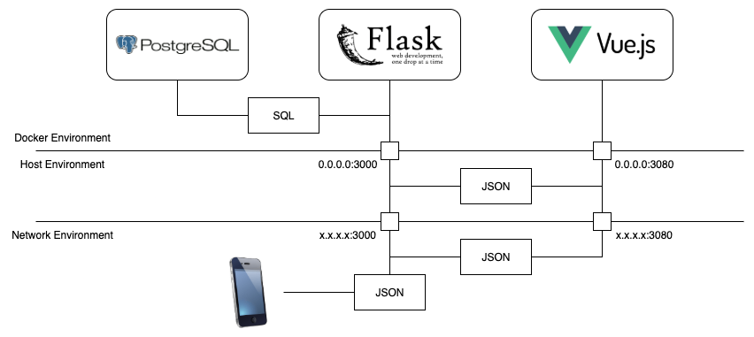

# Template for Backend & Admin GUI - TC2007B 2025

## Project Architecture


## Software Requirements
To run the project successfully, you’ll need to have the following tools installed:
- Git ([https://git-scm.com/downloads](https://git-scm.com/downloads))
    - Create an account in Gitlab ([https://gitlab.com/](https://gitlab.com/))
- Docker ([https://docs.docker.com/engine/install/](https://docs.docker.com/engine/install/))
    - Create an account in Docker Hub ([https://hub.docker.com/](https://hub.docker.com/))
- NodeJS ([https://nodejs.org/en](https://nodejs.org/en))
- Python3 ([https://www.python.org/downloads/](https://www.python.org/downloads/))

## Running Locally on Your Computer
To run the webapp using Docker Compose, follow these steps:

1. **Clone the repository** (if you haven't already):

    ```sh
    git clone https://gitlab.com/mesi2025/project-template.git
    cd project-template
    ```

    Change the default ports in `docker-compose.yml` to as indicated by the instructor
    in the classroom:

    ```yml
    services:
        api:
            build:
            context: api
            dockerfile: Dockerfile
            ports:
            - XXXX:3000 # <- Change XXXX
            environment:
            - DB_HOST=database
        web:
            build:
            context: web
            dockerfile: Dockerfile
            environment:
            - VITE_API_URL=http://api:3000
            ports:
            - XXXX:3080 # <- Change XXXX
        database:
            build:
            context: database
            dockerfile: Dockerfile
    ```

2. **Start the services** using Docker Compose:

    ```sh
    docker compose up --build
    ```

    This command will build the images (if needed) and start all services defined in the `docker-compose.yml` file.

3. **Access the webapp**:

    Open your browser and go to [http://localhost:3080](http://localhost:3080).

4. **Stop the services** when you're done:

    ```sh
    docker compose down
    ```